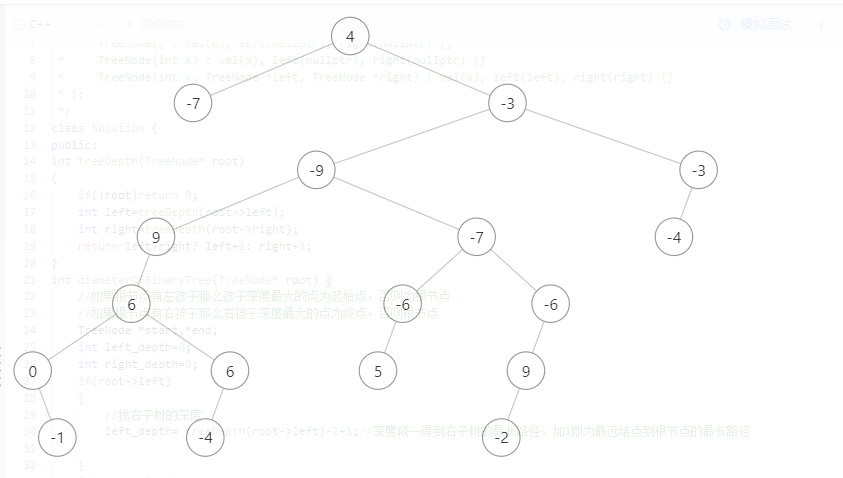

#543二叉树的直径
## 题目描述
https://leetcode-cn.com/problems/diameter-of-binary-tree/

## Tags 
二叉树
## 思路

22.3.22 

错误思路:
> 计算根节点左右最大深度并相加
> 
> 当遇到这种情况时，显然-9作为根节点两边的最大深度相加和更大
> 

改进:
> 对每个结点计算左右子树深度和
> 
> 当出现更大值时更新
> 
## 代码
### C++ Code:
```cpp
// 543二叉树的直径
class Solution_543{
int treeDepth(TreeNode* root)
{   //计算树的深度
if(!root)return 0;
int left=treeDepth(root->left);
int right=treeDepth(root->right);
return left>right? left+1: right+1;
}
int maxpath(TreeNode* root)
{   //对于某个结点计算其左右孩子的深度和

int left_depth=0;
int right_depth=0;
//找右子树的深度
left_depth= treeDepth(root->left)-1+1;//深度减一得到右子树的最长路径，加1即为最远结点到根节点的最长路径
//找左子树的深度
right_depth= treeDepth(root->right)-1+1;//同理
return left_depth+right_depth;
}
void findmax(TreeNode* root,int &max)
{   //中序依次遍历结点，对每个结点计算深度和并更新max
if(!root)return;
findmax(root->left,max);
if(maxpath(root)>max)max= maxpath(root);
findmax(root->right,max);
}
int diameterOfBinaryTree(TreeNode* root) {
int max=0;
findmax(root,max);
return max;
}
};
//思路一样但更简洁的方法
class Solution_543_better{
int ans;
int depth(TreeNode* rt){
if (rt == NULL) {
return 0; // 访问到空节点了，返回0
}
int L = depth(rt->left); // 左儿子为根的子树的深度
int R = depth(rt->right); // 右儿子为根的子树的深度
ans = max(ans, L + R + 1); // 计算d_node即L+R+1 并更新ans
return max(L, R) + 1; // 返回该节点为根的子树的深度
}
public:
int diameterOfBinaryTree(TreeNode* root) {
ans = 1;
depth(root);
return ans - 1;
}
//作者：LeetCode-Solution
// 链接：https://leetcode-cn.com/problems/diameter-of-binary-tree/solution/er-cha-shu-de-zhi-jing-by-leetcode-solution/
};
```

