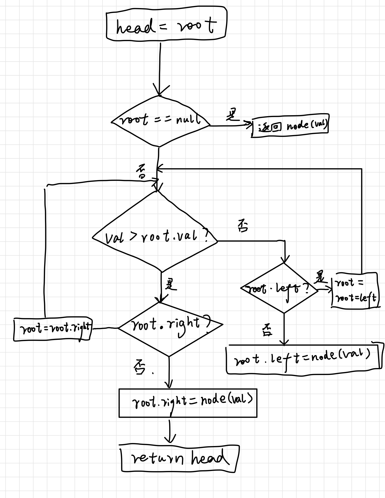

# 701. 二叉搜索树中的插入操作
## 题目描述
给定二叉搜索树（BST）的根节点?root?和要插入树中的值?value?，将值插入二叉搜索树。 返回插入后二叉搜索树的根节点。 输入数据 保证 ，新值和原始二叉搜索树中的任意节点值都不同。

注意，可能存在多种有效的插入方式，只要树在插入后仍保持为二叉搜索树即可。 你可以返回 任意有效的结果 。

来源：力扣（LeetCode）
链接：https://leetcode-cn.com/problems/insert-into-a-binary-search-tree
著作权归领扣网络所有。商业转载请联系官方授权，非商业转载请注明出处。
## 思路

## 代码
### C++ Code:
```cpp
TreeNode* insertIntoBST(TreeNode* root, int val) {
        TreeNode * ans=root;
       //空树，返回一个结点
        if(!root) ans=new TreeNode(val);
        while(root)
    {   //若插入值大于当前值
        if(val>root->val)
        {   //若当前结点无右子树直接插入并结束循环
            if(!root->right)
            {   TreeNode *temp=new TreeNode(val);
                root->right=temp;
                break;
            }
            //若当前结点有右子树，更新当前结点为右子树
            else
            {
                root=root->right;
            }
        }//若插入值小于当前值，即对左子树进行处理
        else {
            if(!root->left)
            {
                TreeNode *temp=new TreeNode(val);
                root->left=temp;
                break;
            }
            else root=root->left;
        }
    }
    return ans;
}
```
