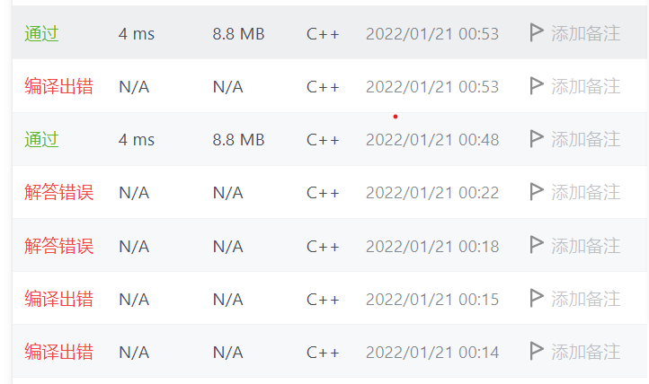
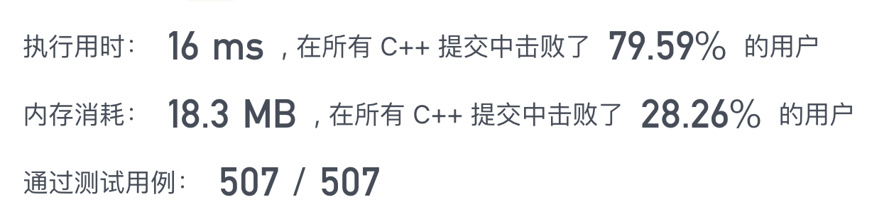
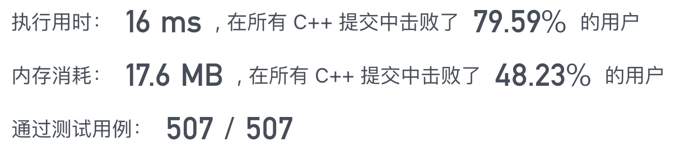

# Leetcode notes

Record of my mistakes, thoughts and everything.

*Practice makes perfect.*

*坚持就是胜利*

# **计划**
基础
* 数组，队列，栈
* 链表
* 树与递归
* 哈希表
* 双指针

第一遍按tag刷，第二遍一题多解，多题同解
# So it begins
## 数组
### 2022.1.18
tag:数组 简单
1. 两数之和
2. 删除有序数组中的重复项
   > o(1)：空间复杂度，即运行过程中临时占用存储空间大小的量度不随
   > 处理数据量n大小而改变
3. 移除元素
4. 搜索插入位置
   用二分写的，注意边界值处理。此题也可暴力解

### 2022.1.20
1.存在重复元素
> STL:sort函数

53.最大子数组和

> pre=max(pre+x,x)
> maxAns=(pre,maxAns)

88.合并两个有序数组
> **二分法**
> 这题写了好久。一定要注意细节
> 

### 2022.1.22

350. 两个数组的交集
> 首先暴力循环没想到过了。
> 思路；用一个if_add数组存储标志nums2中的元素是否已经被添加过，遍历nums1，依次与nums2中元素比较。
> 若num2中元素已被添加过，跳过；若未添加过且与此元素相等加入ans并break，从nums1下一个元素开始依次与nums2中的比较

> char字符应用单引号而不是双引号，排错花了一定时间

121. 买卖股票的最佳时机
> 可能是动态规划问题
>
> 第一想法：双层循环遍历，从第i天买入，第j天卖出若卖出价格大于买入且利润大于之前则更新为maxprofit；
> **超时**

> 抽象具体比较过程，将其当成动态过程，只需要做一次扫描，在每一步寻找最优解；
> 维持更新最小买入和最大利润变量（最大利润变量>0）

> **记得返回答案 = =**
>
### 1.23
566. 重塑矩阵
> 暴力求解 AC
> 思路：首先判断是否合理（行列数相乘看是否相等），再将原矩阵全部展平为向量存储。
> 最后根据所求矩阵行列数，一行行填入答案。空间占用高，时间也高
>
> 官方解：通过两层索引，根据矩阵元素在矩阵中位置下标与列数的关系直接赋值：
> `ans[x/c][x%c]=nums[x/n][x%n]`;
> 时间空间均更优化
>
118. 杨辉三角
> 暴力解决 ，依次求前一行中两个元素的和
36. 有效的数独
   > 用一个二维数组9*9存储是否已经出现过
   
   > 内存可以不使用vector或许会更好？
   >   
73. 矩阵置0
   > 直接AC，但用时内存均不优。思路：先遍历一次用两个set保存需要置0的行列数，再遍历置0。
   > 一次遍历？不可。
   >
---

## 字符串
387. [字符串中的第一个唯一字符](/Problems/387字符串中的第一个唯一字符.md)

383.[赎金信](/Problems/242赎金信.md)

242.[有效的字母异位词](/Problems/242有效的字母异位词.md)

